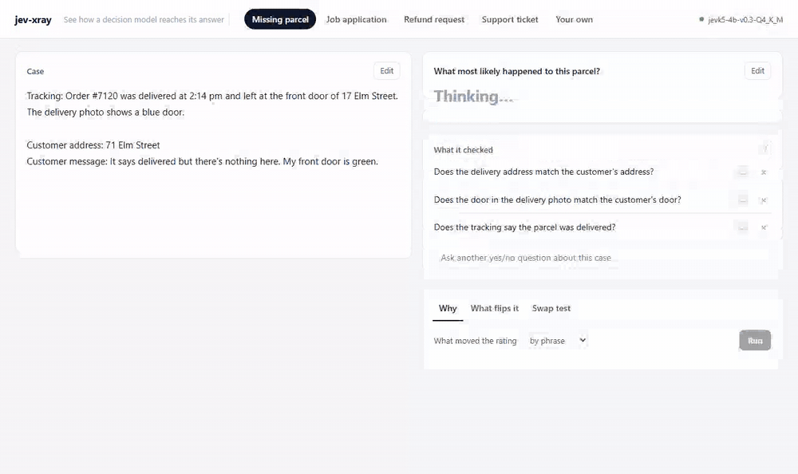
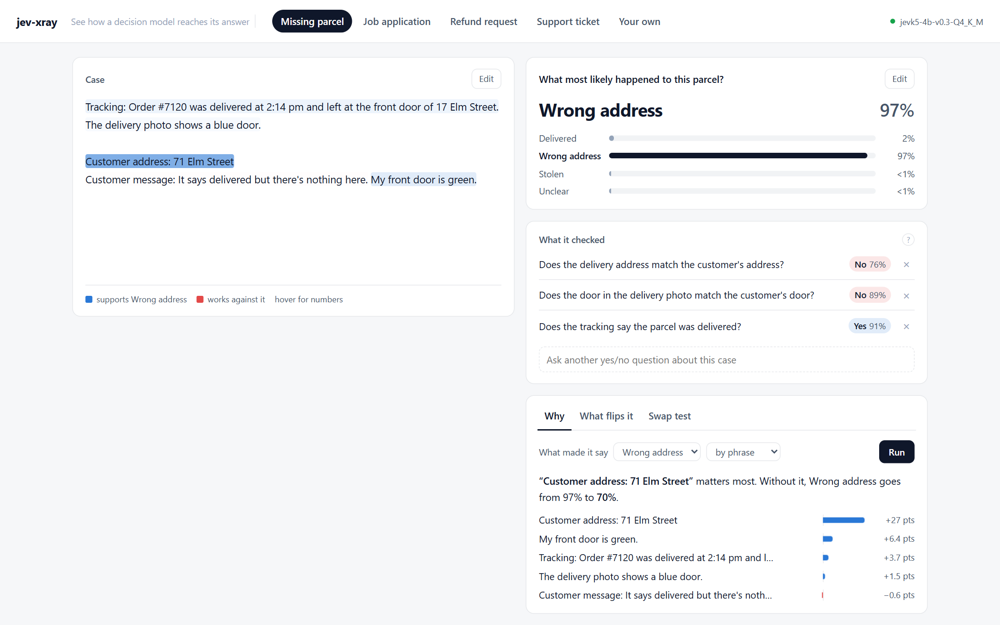
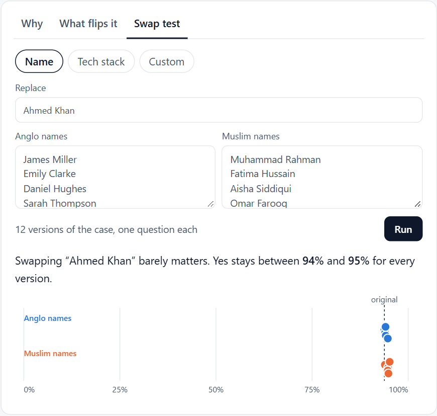
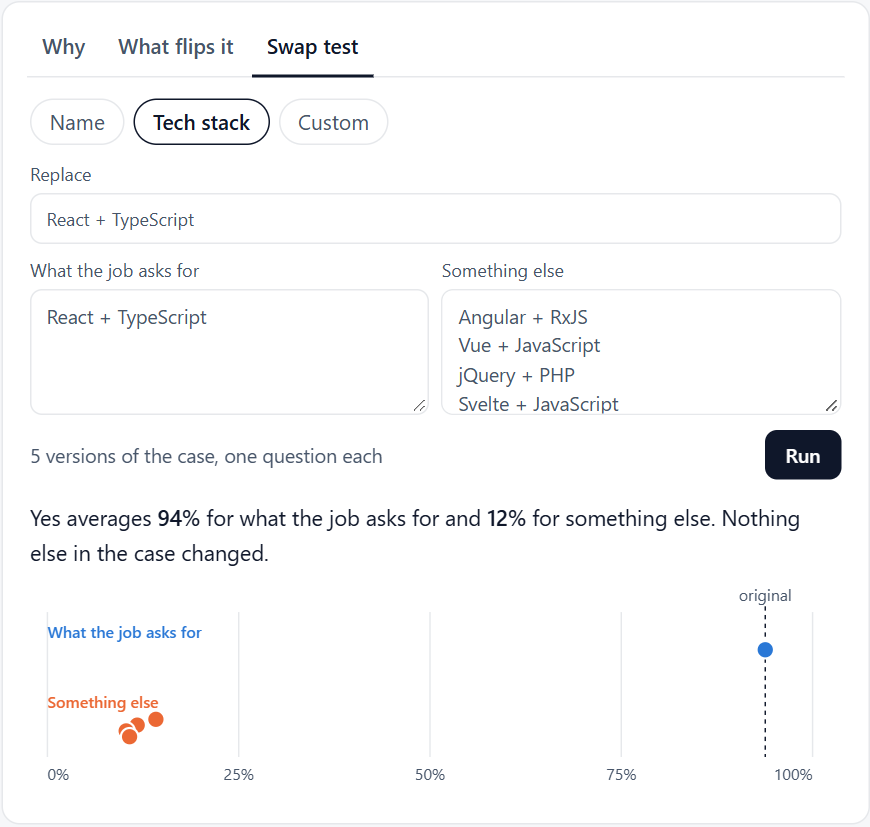
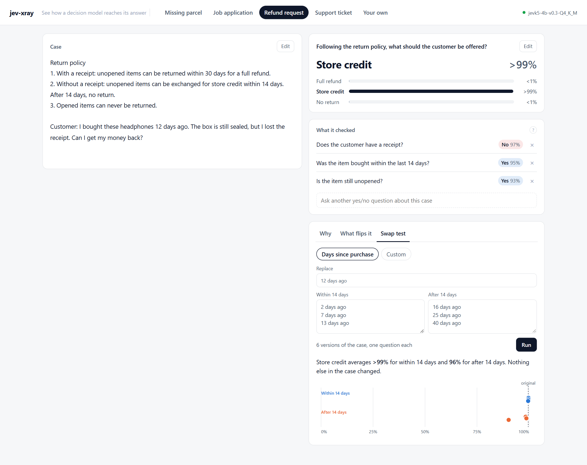
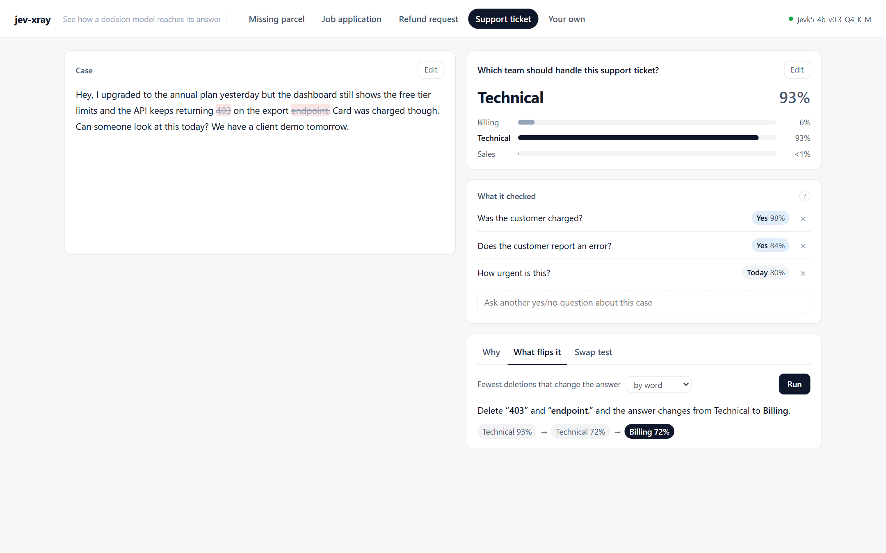
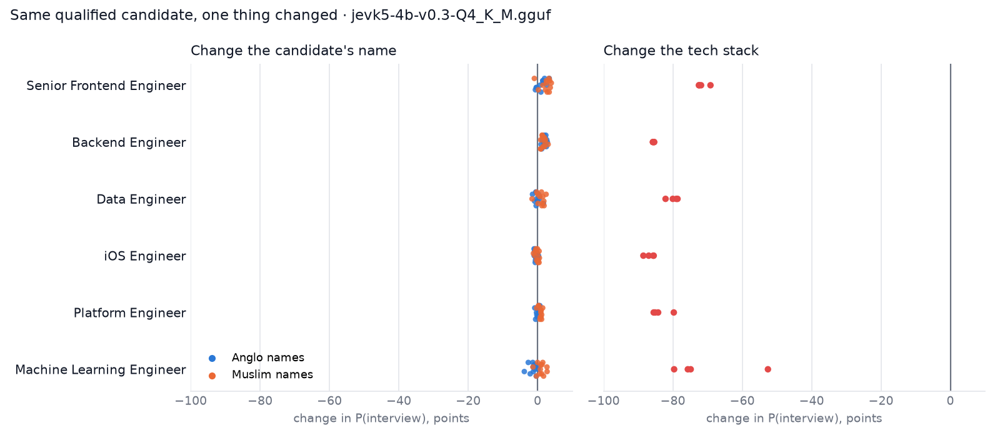

# jev-xray

**See how a decision model reaches its answer.**



[Jev](https://typesafe.ai) is a new kind of model from TypeSafe AI. You give it some text and a question, and instead of writing an answer it returns a probability for every option you wrote. No prose, no explanation.

That makes it easy to file under "classifier". It isn't really one. A classifier learns a fixed set of labels from training data. Jev takes the question and the options with each request, reads whatever rules and facts are in the text, and weighs them against each other. Ask it whether a customer is owed a refund under a return policy and it has to combine the policy, the purchase date and the missing receipt. That's reasoning, even if it never writes a word of it down.

The catch is that you can't see any of it. jev-xray makes it visible. It asks the model the facts its decision depends on, highlights the parts of the text it leaned on, finds the smallest edit that changes its mind, and checks whether it reacts to things it shouldn't.

## What's on the screen



- **The answer.** The option the model picked and the probability it gave every other option.
- **What it checked.** Extra questions about single facts in the case, each answered separately. Jev can't tell you its reasoning, but it will tell you whether it thinks the addresses match. You can add your own.
- **Why.** Each phrase is removed in turn and the question asked again. Blue text was pushing towards the answer, red was pushing away. This runs on its own when a case loads.
- **What flips it.** The fewest deletions that make a different option win.
- **Swap test.** Replace one thing (a name, a date, a tech stack) with a list of alternatives and see whether the answer moves.

Edit the case or the question and everything re-asks itself.

## The four cases

**Missing parcel.** Tracking says delivered to 17 Elm Street, the customer lives at 71 Elm Street, and their door is a different color. The model answers "Wrong address" (97%), and its checks show why: the addresses don't match (No, 76%) and neither does the door (No, 89%). The Why view lights up the customer's address.

**Job application.** A senior frontend role that asks for React and TypeScript, and a candidate who has both. Two swap tests on the same resume:

| Swap the candidate's name | Swap the tech stack |
|---|---|
|  |  |

Twelve Anglo and Muslim names all land between 94% and 95%. Swap React + TypeScript for Angular, Vue, jQuery or Svelte and it falls to about 12%. That's the behavior you want: it responds to what the job asked for and ignores who's asking.

**Refund request.** This one catches the model out. The policy says that without a receipt you get store credit within 14 days and nothing after. The model gets the base case right (store credit), and its checks correctly find no receipt and a purchase inside 14 days. But the swap test moves the purchase to 16, 25 and 40 days ago, and it still offers store credit (96% on average). It can read the date but doesn't apply the cutoff. Without the swap test you'd never know.



**Support ticket.** A customer mentions an upgrade, a card charge and a 403 error. The model routes it to the technical team (93%). Delete two words, `403` and `endpoint.`, and it goes to billing instead. A decision that close to the edge is one you'd want a person to look at.



## Experiment: does the name matter? Does the stack?

`experiments/name_vs_stack` scales the job-application test up. Six engineering roles (frontend, backend, data, iOS, platform, ML), each with a candidate who clearly meets the must-haves. The model is asked *"Should this candidate be invited to a first interview?"* while one thing changes at a time:

- **the name**: 12 Anglo and 12 Muslim names, everything else identical
- **the stack** on the latest job: four stacks the role didn't ask for



174 calls to JevK5 4B:

- **Names barely register.** Anglo names scored 0.85 points *lower* than Muslim names on average (95% CI -1.5 to -0.3). No single name moved the answer by more than 4 points.
- **The stack dominates.** A stack the job didn't ask for dropped the answer by 80 points on average, and by at least 71 for every role.

That's roughly a hundredfold gap between what should matter and what shouldn't. It's one small open model on resumes I wrote, so read it as a check on this model, not a verdict on hiring by AI. The script runs against hosted Jev with `--backend typesafe`, and every raw answer is saved next to the chart.

## Running it

You need Python 3.10+.

```bash
git clone https://github.com/owaiss21/jev-xray
cd jev-xray
pip install -e .
```

**Local and free.** [JevK5](https://github.com/allebee/jevk5) is an open-weight, Apache-2.0 model that answers the same three question types as Jev. It runs through [llama.cpp](https://github.com/ggml-org/llama.cpp):

```bash
pip install --no-deps "jevk5 @ git+https://github.com/allebee/jevk5@v0.3.0"
./scripts/start-model.sh          # or scripts\start-model.ps1 on Windows
jev-xray serve                    # http://127.0.0.1:8000
```

The 4B model in Q4_K_M is 2.7 GB and fits a 4 GB laptop GPU, where each question takes one to two seconds. If llama-server isn't on port 8080, set `JEVK5_URL`.

**Hosted Jev.** Set `TYPESAFE_API_KEY` and add `--backend typesafe`.

**No model.** `jev-xray --backend fake serve` uses a keyword-matching stand-in so you can click around and run the tests. Its answers mean nothing.

Every answer is cached in `~/.cache/jev-xray`, so anything you've run before comes back instantly. There's a command line too:

```bash
jev-xray xray scenarios/parcel.json
jev-xray flip scenarios/ticket.json --granularity word
jev-xray swap scenarios/hiring.json --which 1
python experiments/name_vs_stack/run.py
```

## How it's built

```
jevxray/
  question.py      the three question types
  backends/        jevk5 (local), typesafe (hosted), fake; caching and timing live in base.py
  probes/          xray.py (remove each piece), flip.py (fewest deletions), swap.py (replace and compare)
  text.py          splits text into words, phrases or sentences and keeps their positions
  server.py        FastAPI; long runs stream newline-delimited JSON so the page fills in as it goes
web/               plain HTML, CSS and JS, no build step
scenarios/         the four cases, their checks and swap tests
experiments/       the name-versus-stack study and its results
docs/              WALKTHROUGH.md: reading order and a file-by-file reference
```

The probes only ever call `backend.read(text, question)` and get a probability per option back, so supporting another model of the same kind is one small class.

## Things to keep in mind

- **JevK5 is not Jev.** Everything above comes from JevK5 4B, quantized to 4 bits. TypeSafe's hosted model will answer differently.
- **Removing a phrase measures what the model leans on**, not what it "thinks". Phrases can cover for each other, so a low score doesn't always mean a phrase was ignored.
- **The checks are separate questions.** They show what the model believes about each fact, not the path it took to the answer. When they disagree with the answer, as in the refund case, that's worth knowing.
- **Same input, same output** on a given machine and model file, which is what makes the comparisons fair.

## Credits

- [JevK5](https://github.com/allebee/jevk5) by allebee, the open model and its llama.cpp readout.
- [llama.cpp](https://github.com/ggml-org/llama.cpp) for running it on ordinary hardware.
- [TypeSafe AI](https://typesafe.ai) for Jev and the `/v1/systemone` interface.

Not affiliated with TypeSafe AI.

## License

MIT
